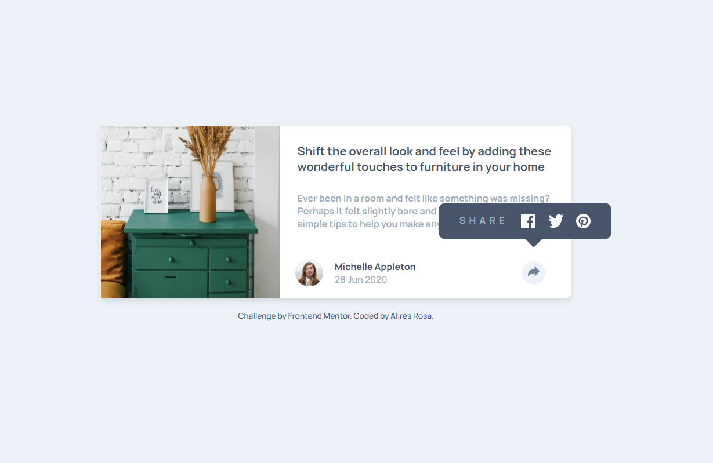

# Frontend Mentor - Article preview component solution

### The challenge

Users should be able to:

- View the optimal layout for the component depending on their device's screen size
- See the social media share links when they click the share icon

### Screenshot

- My solution

### Links

- Solution URL: [Add solution URL here](https://github.com/DomeniqueRosa/DomeniqueRosa.github.io/tree/main/article-preview-component-master)
- Live Site URL: [Add live site URL here](https://domeniquerosa.github.io/article-preview-component-master/)

## My process

### Built with

- Semantic HTML5 markup
- CSS custom properties
- Flexbox
- CSS Grid

### What I learned

I learned about position: relative and position: absolute, understanding how the behavior of these properties relates to the parent element. I also learned how to add and remove a class to apply effects through opacity.

## Author
# Frontend Mentor - Article preview component solution

### The challenge

Users should be able to:

- View the optimal layout for the component depending on their device's screen size
- See the social media share links when they click the share icon

### Screenshot

- My solution

### Links

- Solution URL: [Add solution URL here](https://github.com/DomeniqueRosa/DomeniqueRosa.github.io/tree/main/article-preview-component-master)
- Live Site URL: [Add live site URL here](https://domeniquerosa.github.io/article-preview-component-master/)

## My process

### Built with

- Semantic HTML5 markup
- CSS custom properties
- Flexbox
- CSS Grid

### What I learned

I learned about position: relative and position: absolute, understanding how the behavior of these properties relates to the parent element. I also learned how to add and remove a class to apply effects through opacity.

## Author

- GitHub - [Alires Rosa](https://github.com/AliresRosa)

