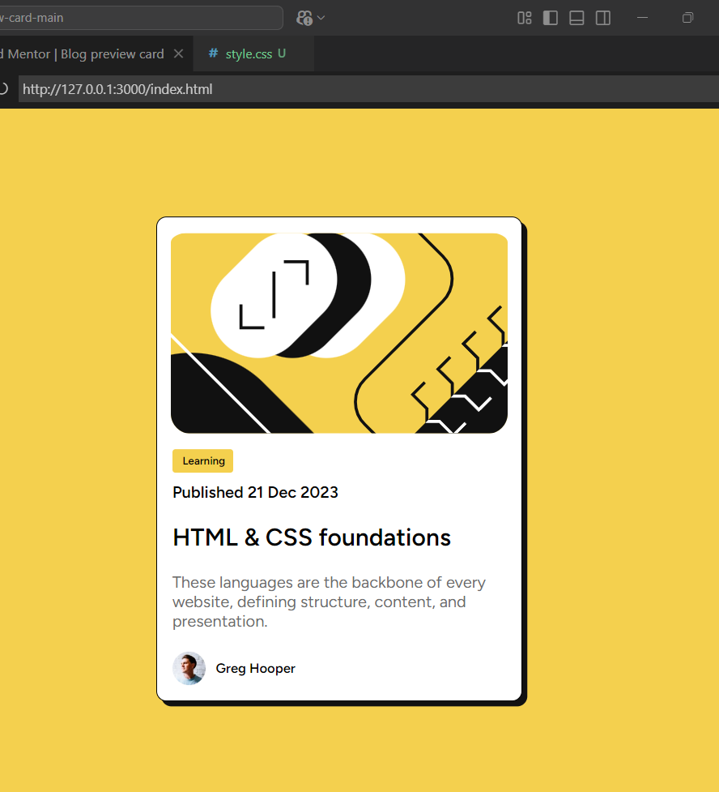

# Frontend Mentor - Blog preview card solution

This is a solution to the [Blog preview card challenge on Frontend Mentor](https://www.frontendmentor.io/challenges/blog-preview-card-ckPaj01IcS). Frontend Mentor challenges help you improve your coding skills by building realistic projects. 

### The challenge

Users should be able to:

- See hover and focus states for all interactive elements on the page

### Screenshot

### Links

- Solution URL: [Add solution URL here](https://github.com/DomeniqueRosa/DomeniqueRosa.github.io/tree/main/blog-preview-card-main)
- Live Site URL: [Add live site URL here](https://domeniquerosa.github.io/blog-preview-card-main/)

### Built with

- Semantic HTML5 markup
- CSS custom properties

