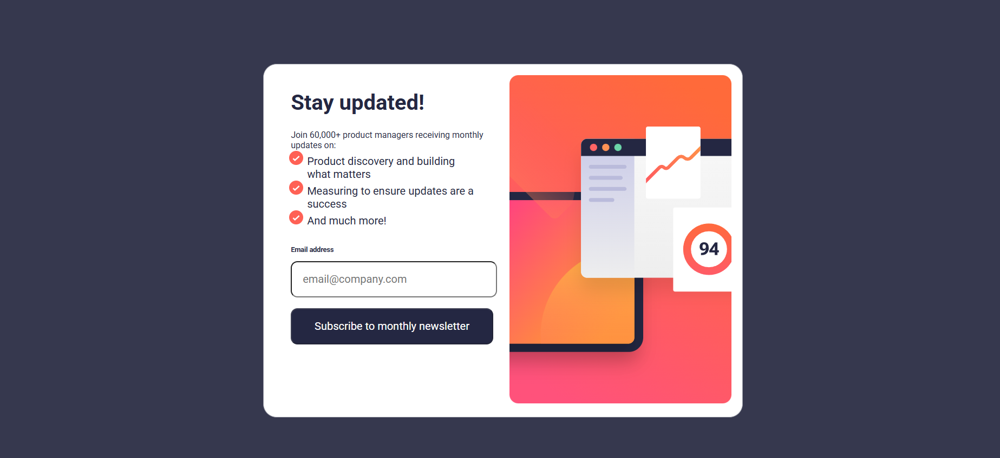

# Frontend Mentor - Newsletter sign-up form with success message solution

This is a solution to the [Newsletter sign-up form with success message challenge on Frontend Mentor](https://www.frontendmentor.io/challenges/newsletter-signup-form-with-success-message-3FC1AZbNrv). Frontend Mentor challenges help you improve your coding skills by building realistic projects. 

### The challenge

Users should be able to:

- Add their email and submit the form
- See a success message with their email after successfully submitting the form
- See form validation messages if:
  - The field is left empty
  - The email address is not formatted correctly
- View the optimal layout for the interface depending on their device's screen size
- See hover and focus states for all interactive elements on the page

### Screenshot

### Links

- Solution URL: [Add solution URL here](https://github.com/DomeniqueRosa/DomeniqueRosa.github.io/tree/main/newsletter-sign-up)
- Live Site URL: [Add live site URL here](https://domenique-rosa-github-io-ezos.vercel.app/)

## My process

### Built with

- Semantic HTML5 markup
- CSS custom properties
- Flexbox
- CSS Grid
- Mobile-first workflow
- [Vite + Vue](https://vite.dev//) - JS library

### What I learned

In this project, I learned to work with the Vue framework using Vite, creating reusable components and setting up routes. I studied directives like v-if, :disabled, and :class to control elements and dynamically apply CSS classes, helping me build dynamic and efficient web applications.

## Acknowledgments

### Step 1: Install Vite

 - npm create vite@latest 

### Step 2: Install dependencies

Inside the folder of the project

- npm install

### Step 3: Install Router

- npm install vue-router

### Step 4: Run the development server

- npm run dev

### Step 5:  Building the App for Production

- npm run build

This will generate a dist folder containing all the optimized files for production.

