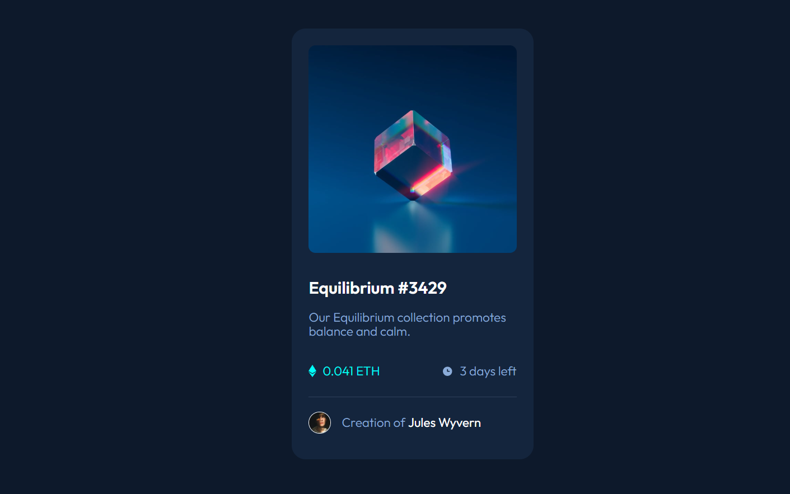

# Frontend Mentor - NFT preview card component solution

This is a solution to the [NFT preview card component challenge on Frontend Mentor](https://www.frontendmentor.io/challenges/nft-preview-card-component-SbdUL_w0U). Frontend Mentor challenges help you improve your coding skills by building realistic projects. 

### The challenge

Users should be able to:

- View the optimal layout depending on their device's screen size
- See hover states for interactive elements

### Screenshot

- My Solution

### Links

- Solution URL: [Add solution URL here](https://github.com/DomeniqueRosa/DomeniqueRosa.github.io/tree/main/nft-preview-card-component-main)
- Live Site URL: [Add live site URL here](https://domeniquerosa.github.io/nft-preview-card-component-main/)

### Built with

- Semantic HTML5 markup
- CSS custom properties
- Flexbox
- CSS Grid

### What I learned

I learned to add interactivity to elements using JavaScript's classList.toggle() method to toggle (add or remove) a class from an element, making it easier to apply dynamic styles. Additionally, I learned to use normalize.css to reset the default styles from browsers, providing a more consistent base and making it easier to customize the design.

## Author
 - Alires Rosa
