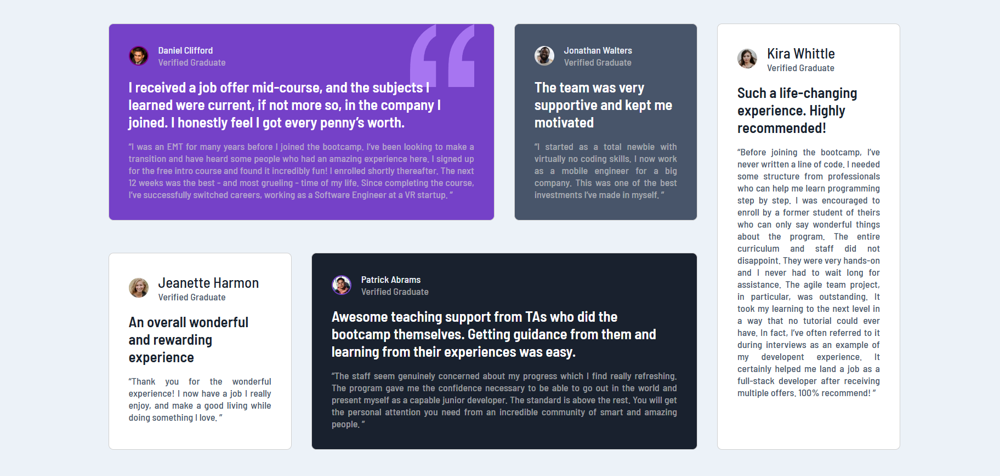

# Frontend Mentor - Testimonials grid section solution

This is a solution to the [Testimonials grid section challenge on Frontend Mentor](https://www.frontendmentor.io/challenges/testimonials-grid-section-Nnw6J7Un7). Frontend Mentor challenges help you improve your coding skills by building realistic projects. 

### The challenge

Users should be able to:

- View the optimal layout for the site depending on their device's screen size

### Screenshot

- Expect

- My final project

### Links

- Solution URL: [Add solution URL here](https://github.com/DomeniqueRosa/DomeniqueRosa.github.io/tree/main/testimonials-grid-section-main)
- Live Site URL: [Add live site URL here](https://domeniquerosa.github.io/testimonials-grid-section-main/)

### Built with

- Semantic HTML5 markup
- CSS custom properties
- Flexbox
- CSS Grid

### What I learned

I learned to use the grid-template-areas property, which makes it much easier to organize items in their proper places.
